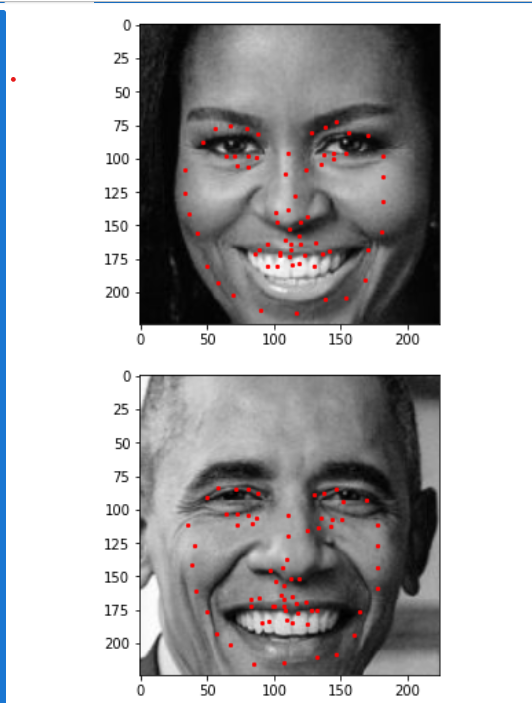

# Facial Keypoint Detection

A deep learning project focused on detecting facial landmarks using **Convolutional Neural Networks (CNNs)**. This project was completed as part of the [Computer Vision Nanodegree Program by Udacity](https://www.udacity.com/course/computer-vision-nanodegree--nd891) and demonstrates a complete pipeline for facial keypoint detection.

---

## 🌟 Project Overview

Facial keypoints are important features for face recognition, tracking, and expression analysis. This project implements a CNN-based pipeline to predict facial keypoints such as eyes, nose, and mouth corners. The pipeline includes:

- Data preprocessing and augmentation
- CNN architecture design for regression
- Model training and evaluation
- Creative visual applications of predicted keypoints

The model is trained on a dataset of annotated facial images to learn landmark localization accurately.

---

## 📂 Repository Structure

```
Facial-Keypoint-Detection/
├── 1. Load and Visualize Data.ipynb           # Explore the dataset and visualize facial keypoints
├── 2. Define the Network Architecture.ipynb   # Train and test CNN architecture for keypoint detection
├── 3. Facial Keypoint Detection, Complete Pipeline.ipynb   # End-to-end training and evaluation
├── 4. Fun with Keypoints.ipynb                # Use the trained model for creative applications
├── data_load.py                               # PyTorch Dataset and data loading utilities
├── models.py                                  # CNN model definitions for regression task
├── README.md                                  # Project overview and setup guide (this file)
├── Project description.md                     # Detailed project write-up or background information
├── LICENSE                                    # License for project usage and distribution
├── requirements.txt                           # List of required Python packages
├── detector_architectures/                    # Haar cascade detections
├── saved_models/                              # Directory that contains the trained model(s)
└── images/                                    # Sample images
```

---

## 🧠 Model Architecture

The convolutional network includes several layers of convolution, activation (ReLU), max-pooling, and dropout for regularization. The final layer outputs (x, y) coordinates for each keypoint.

---

## 🖼️ Sample Results



---

## 📊 Dataset

- **Dataset:** Facial keypoint detection dataset (Loaded inside the notebooks from AWS S3 object)
- **Preprocessing:** Grayscale conversion, resizing, normalization, and keypoint normalization

> Ensure the dataset is downloaded and placed in the appropriate folder before running notebooks.

---

## ⚙️ Setup & Requirements

To run the project locally, follow these steps:

1. **Clone the repository:**

```bash
git clone https://github.com/DiaeddinTahboub/Facial-Keypoint-Dectection
cd Facial-Keypoint-Detection
```

2. **Install dependencies:**

```bash
pip install -r requirements.txt
```

3. **Run the notebooks in order:**

- `1. Load and Visualize Data.ipynb`
- `2. Define the Network Architecture.ipynb`
- `3. Facial Keypoint Detection, Complete Pipeline.ipynb`
- `4. Fun with Keypoints.ipynb`

---

## ✅ Features

- Custom PyTorch CNN for facial keypoint regression
- Interactive notebooks for visualization and training
- Structured and modular codebase
- Creative applications with keypoint predictions

---

## 📚 References

- [Udacity Computer Vision Nanodegree](https://www.udacity.com/course/computer-vision-nanodegree--nd891)
---

## 📝 License

This project is licensed under the MIT License. See the [LICENSE](LICENSE) file for details.

---

## 🙌 Acknowledgements

This work was completed as part of the Udacity Computer Vision Nanodegree. Special thanks to Udacity mentors and reviewers for their guidance and feedback.
